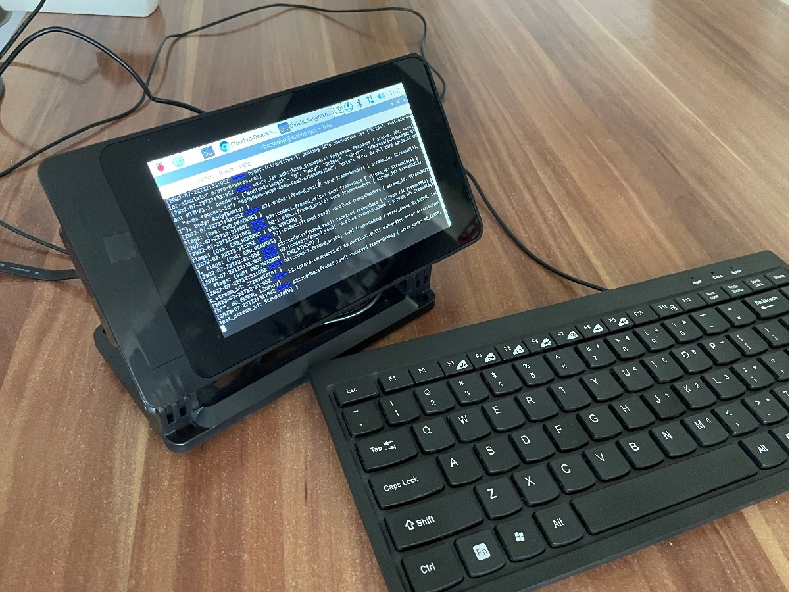
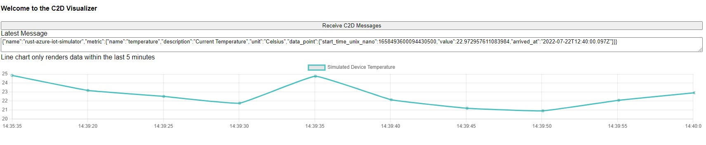

# Motivation
There are several [Azure IoT device simulators](https://docs.microsoft.com/de-de/azure/iot-hub/quickstart-control-device?pivots=programming-language-csharp) written in different languages (e.g., C#, Node.js, Python, etc.) available. However, the embedded industry focuses on performance, binary size, and safety. This might be an issue for classical OOP-oriented languages. 

## Why Rust?
Rust is a low-level statically-typed multi-paradigm programming language that's focused on safety and performance. It solves problems that C/C++ has been struggling with for a long time, such as memory errors and building concurrent programs. According to the [Stack Overflow Developer Survey 2021](https://insights.stackoverflow.com/survey/2021), Rust is the most beloved language.

## Goal of the Project


We will run a temperature simulator and send data to an [gRPC](https://grpc.io/) endpoint via the [OpenTelemetry Protocol](https://opentelemetry.io/docs/reference/specification/protocol/). The receiver converts incoming data and send it via [MQTT](https://mqtt.org/) to an [Azure IoT Hub](https://azure.microsoft.com/en-us/services/iot-hub/) instance. You can  visualize incoming data by running a [web app](https://github.com/christopher-wilke/rust-azure-iot-simulator/tree/main/c2d-visualizer) on your local machine.

The solution is optimized for embedded devices (e.g., `STM32`, `Raspberry Pi`, etc.) as we have an device app with a low footprint (less than 4MB). Rust also supports multiple hardware architectures, you can find `armv7` and `x86_64` binaries in the [release page](https://github.com/christopher-wilke/rust-azure-iot-simulator/releases).

# Run the Device App

## Prerequisites
If you want to run the sample, you need an active [Azure Account](https://azure.microsoft.com/en-us/free/). Please also make sure to install the latest [Azure CLI](https://docs.microsoft.com/en-us/cli/azure/install-azure-cli).

### Create an IoT Hub
1. In the first CLI session, run the az extension add command. The command adds the Microsoft Azure IoT Extension for Azure CLI to your CLI shell. The IOT Extension adds IoT Hub, IoT Edge, and IoT Device Provisioning Service (DPS) specific commands to Azure CLI.

```sh
az extension add --name azure-iot
```

2. In the first CLI session, run the `az group create` command to create a resource group. The following command creates a resource group named MyResourceGroup in the eastus location.

```sh
az group create --name MyResourceGroup --location {your region}
```

3. You can then create the IoT hub, this process may take a few minutes to complete.
```sh
az iot hub create --resource-group MyResourceGroup --name {YourIoTHubName}
```

### Create the Azure IoT Hub Device and retrieve the Connection String
1. In the CLI session, run the `az iot hub device-identiy create` command which creates a device identitiy.

```sh
az iot hub device-identity create -d simDevice -n {YourIoTHubName}
```

2. When you are ready to set up your device, you need the connection string that links your phyiscal device with its identity in the IoT Hub. Use the `` 

## Run the App
You can simply download and run one of the [release binaries](https://github.com/christopher-wilke/rust-azure-iot-simulator/releases) (we currently provide `armv7` for Raspberry Pi or `x86_64` for classic Ubuntu VMs) or clone and compile the source code locally. As this project is all about learning Rust and its tools, we will walk through the local cloning and building procedure. The following steps were being tested on `Ubuntu 20.04.4 LTS`.

### Install Rust
1. Before installing Rust, we need to ensure our system packages and repositories are updated.

```sh
sudo apt-get update && sudo apt-get upgrade
```

2. Once we have our system updated and ready, we can install the Rust compiler. I prefer the Rustup installer script (`default` settings).

```sh
curl --proto '=https' --tlsv1.2 -sSf https://sh.rustup.rs | sh
```
3. Once the installation is complete, add the Rust development environment to your system path using the source command. The `~/.cargo/bin` directory holds the tools for Rust development, including the rustc command, rustup, cargo, etc.

```sh
source $HOME/.cargo/bin
```

4. Run the following command to verify that Rust was successfully installed.

```sh
rustc --version
```
### Run the Device App
Before compiling and running the app, we need to make sure that all related artifacts are available. 

1. Clone the solution using your preferred git client

```sh
git clone https://github.com/christopher-wilke/rust-azure-iot-simulator
```
2. Pull the `opentelemetry-proto` submodule, you will find the files in the `lib` folder

```sh
git submodule update --recursive --init
```

3. Rename the file `sample.yaml` to `base.yaml` in the `configuration` folder and update the device settings.

```sh
sudo mv ./configuration/sample.yaml ./configuration/base.yaml
```

4. Run the App (optional: use `debug` log level to get further log insights)

```sh
RUST_LOG=debug cargo run
```

Depending on your hardware architecture, the first time you compile the app can take some time. You will get there!

# Visualize Iot Hub Device Data
There are multiple ways to visualize or retrieve streams from the IoT Hub. We will discuss two options.

## Watch C2D Messages in Visual Studio Code
1. Make sure to install the [Azure IoT Tools Extensions](https://marketplace.visualstudio.com/items?itemName=vsciot-vscode.azure-iot-tools)
2. In `Explorer` view of VS Code, expand Azure IoT Hub Devices section in the bottom left corner
3. Click `Select IoT Hub` in context menu
4. After you sign in, your Azure Subscription list will be shown, then select Azure Subscription and IoT Hub
5. The device list will be shown in Azure IoT Hub Devices tab in a few seconds
6. Right-click your device and select `Start Monitoring Built-in Event Endpoint`
7. The monitored messages will be shown in `OUTPUT > Azure IoT Hub view`
8. To stop monitoring, right-click the `OUTPUT` view and select `Stop Monitoring Built-in Event Endpoint`

## Run the Web App on your Machine

I created a simple web application which visualizes incoming data in a line chart provided by [chart.js](https://www.chartjs.org/).

1. Open your IoT Hub Instance on [Azure](portal.azure.com) and open the tab `Built-in endpoints`. Copy the `Event Hub-compatible endpoint`.
2. CD into `c2d-visualizer` and open `index.js` located in the `src` folder. Insert the Connection String in `Line 10`. 
3. Install Node and NPM
```sh
sudo apt install npm node.js
```
4. Install the packages
```sh
npm install
```
5. Bulild the web application using the `build script` (you can find it in `package.json`)
```sh
npm run build
```
6. Run the solution
```sh
npm run start
```

You can then open your web browser on `localhost:8080`. Click on `Receive C2D Messages` to watch incoming data. The line chart gets updated automatically. If you want to stop the web server, simply press `CTRL+C` in your terminal.

# To do:

- Integrate React into Client Frontend
- Write Unit Tests and document code using [Documentation Tests](https://doc.rust-lang.org/rustdoc/write-documentation/documentation-tests.html)
- Test Cross-Compilation Binaries
- Multithreading using `tokio.rs`